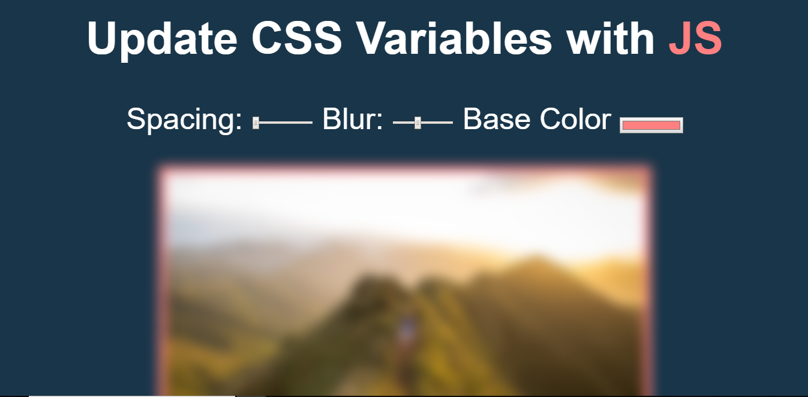
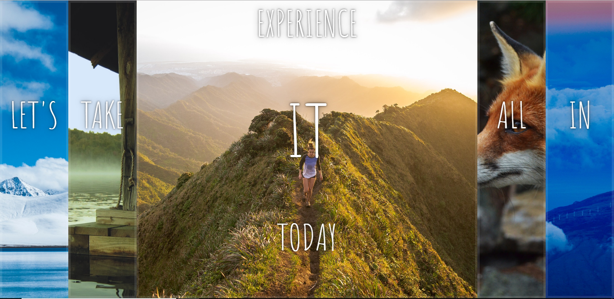

# 30 Day's 30 Applications

### Project 1 - Drum kit

`In this project we have build the drum kit that let you to play music with keyboard keys.`

* Audio tag and its functionality

* how to bind/unbind events on keypress 

* how to use kbd tag

* how to use transition and transform css3 properties

### Project 2 - CSS + JS Clock

`In this project we have build the clock.`

* Transform functionality

* Transform-time functionality 

* How to use cubic-bezier for setting the speed.

### Project 3 - CSS Variables using JS

`In this project we have change the CSS properties of image using JS.`

* CSS Variables

* Using CSS Variables in JS 

* How to use change CSS using JS.

### Project 4 - Array Cardio

`In this project we have learned about different properties of Array.`

* Array.prototype.filter()- As the name suggest if filters out the array.

* Array.prototype.map()- It returns only the desired key value pair.

* Array.prototype.sort()- It sorts the data.

* Array.prototype.reduce()- It reduces the array based on the property defined.

### Project 5 - Flex Box Image Gallery

`In this project we have learned about flex and its different properties.`

* Using Flex Boxes.

* How to transform flex on click.

* CSS properties of flex.

